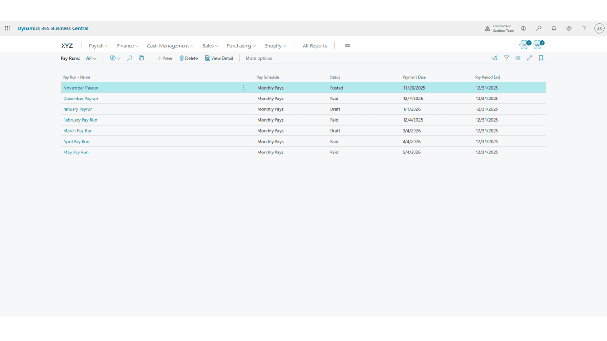
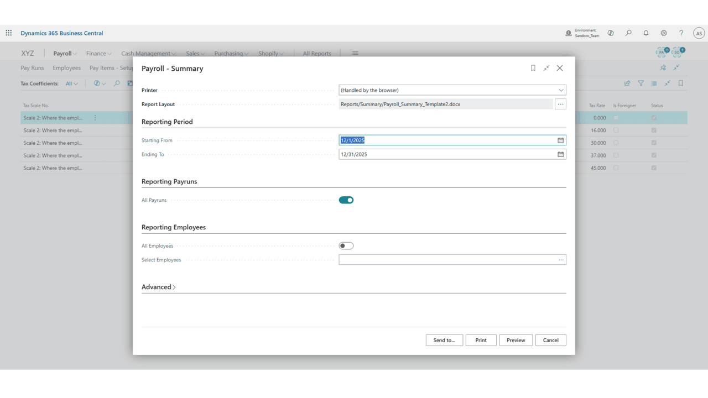
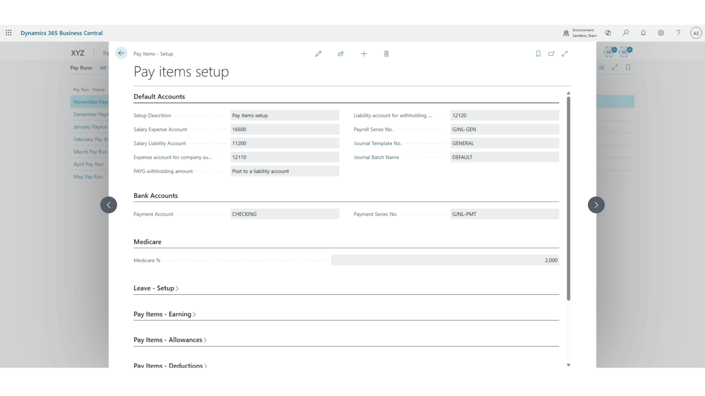

# Australian Payroll System for Dynamics 365 Business Central

**A complete end-to-end Payroll solution** built for Australian compliance — featuring salary processing, PAYG tax, Superannuation, and guided pay runs.

---

## 📋 Project Overview

This extension transforms Dynamics 365 Business Central into a full-featured **Australian Payroll System**. It automates the entire payroll lifecycle — from drafting pay runs to calculating taxes, super contributions, and generating payslips — while ensuring compliance with ATO (Australian Taxation Office) requirements.

Designed with a user-friendly guided workflow, it significantly reduces manual effort for payroll officers and accountants.

---

## ✨ Key Features

- **Full Payroll Cycle Management** (Draft → Process → Post → Pay)
- **Automatic PAYG Tax Calculation**
- **Superannuation Contributions** handling
- **Earnings, Allowances, Deductions & Reimbursements** management
- **Bulk & Individual Payslip Generation**
- **Guided Actions** with helpful instructions
- **Audit Trail** and detailed salary breakdowns
- **Employee Salary Setup & History**

---

## 🛠 Technical Implementation

### Main Objects

| Type       | Folder      | Description |
|------------|-------------|-----------|
| Tables     | Tables      | Core payroll tables (Pay Run, Salary Lines, etc.) |
| Pages      | Pages       | Pay Run management, Salary Setup, Payslip pages |
| Reports    | Reports     | Payslip and payroll reports |
| Queries    | Queries     | Optimized data retrieval for performance |
| Translations | Translations | Multi-language support |

**Key Highlights:**
- Guided workflow using actions with "About Text"
- Proper separation of setup, processing, and posting logic
- Built following Microsoft best practices for extensions

---

## 📸 Screenshots

*(Add your screenshots in the `images/` or `assets/` folder)*

**Pay Run Processing**  

**Salary Detail & Breakdown**  

<!-- 
**Payslip Generation**  
 -->

**Salary Setup**  

---

<!-- ## 🚀 Installation & Setup

1. Publish the extension to your Business Central environment
2. Set up **Salary Items**, **Allowances**, **Deductions**, and **Bank Accounts**
3. Configure employees with salary details
4. Create a new **Pay Run**, add employees, and follow the guided steps:
   - Process Pay Run
   - Post Journal Entries
   - Post Payments
   - Generate Payslips

--- -->

## 💡 Best Practices Applied

- User-centric guided workflow
- Clean code structure with proper separation of concerns
- Performance optimized using Queries
- Ready for localization (already has translation files)
- Production-ready design

---

## 📄 License

This is a **company project** showcasing advanced Dynamics 365 Business Central development skills, specifically in the **Payroll & Localization** domain.

---

**Alishba Javed**  
Dynamics 365 Business Central Developer  
Lahore, Pakistan

---

**This project demonstrates my ability to deliver complex, compliance-heavy, real-world business solutions in Business Central.**
